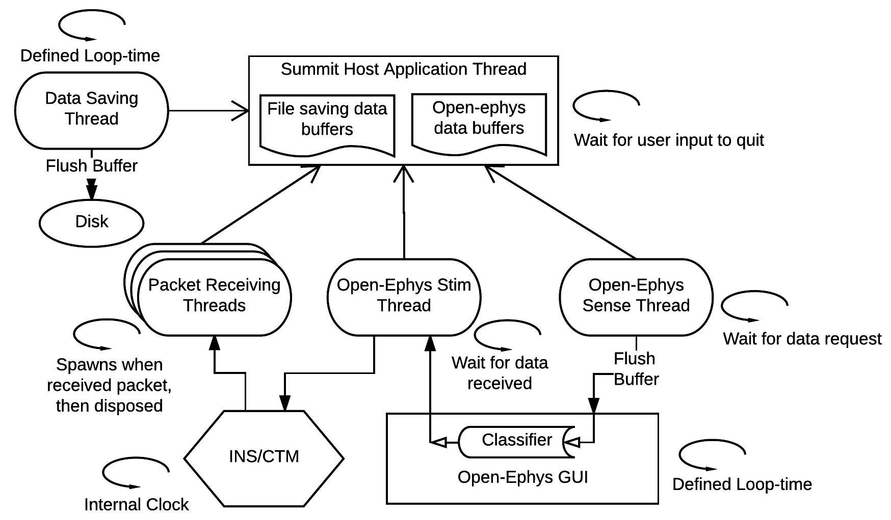
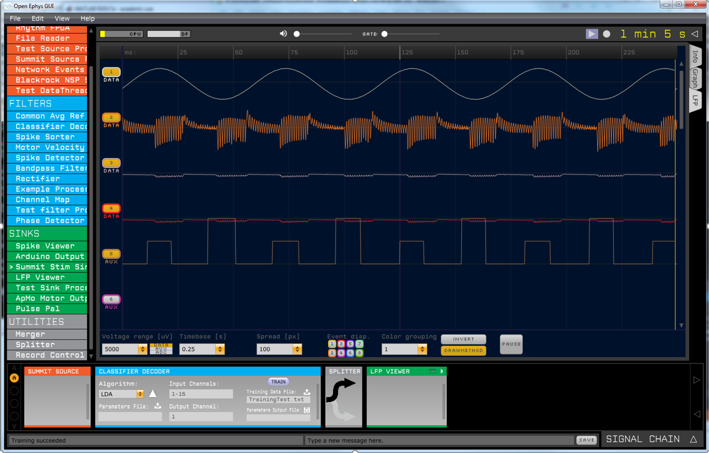
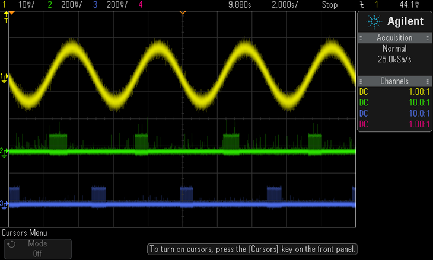

Borton Lab Summit Interface Project (SIP)
=====
David Xing, last updated 6/18/2018

Introduction
--------------------------
This command line program was created to provide an easy way to setup and control Medtronic's RC+S (or other hardware using the Summit system) sensing and stimulating capabilities. The SIP provides 3 main functionalities:

  * Configure sensing and stimulation by editing the stim and sense parameters in a JSON file. The SIP will read in the file and automatically set up the RC+S according to the specified parameters. Some error checking of parameters is provided (i.e. will throw an error if you try to set up anode and cathode on different bores)

  * Real-time manual control of stimulation. Lets users change amplitude, frequency, and pulse width of stimulation with keyboard buttons. Also allows for switching between programs and groups (basically all the functionality of the "Summit Stimulation" training Code). However it has the additional functionality of letting you set up a stimulation run that sweeps across stimulation parameters (i.e. stimulate 2 sec bursts at 0.2, 0.4, 0.6, 0.8, and 1mA with 2 sec rest between bursts) with a single button push.

  * Streaming to/interfacing with the [Open-ephys GUI](http://www.open-ephys.org/gui/). The SIP is able to buffer and stream the sense data from the RC+S to Open-ephys. Any of the Open-ephys plugins can then be used on the data (i.e. the LFP viewer to display the sense data in real-time). The SIP is also able to receive commands from Open-ephys; this can be leveraged for computer-in-the-loop experiments where signal processors/classifiers/decoders plugins in Open-ephys can be used to control stimulation based on the incoming sense data. The custom Open-ephys plugin for interfacing with the SIP can be found at the [Borton lab Github](https://github.com/neuromotion/bnml-oegui-plugins/tree/master/SummitSource)


In addition to the above, much of the Summit training code has been consolidated into the SIP. It is able to:

* check and display CTM/INS battery levels  
* run impedance testing  
* fill in missing data from dropped packets with linear interpolation (still kind of buggy though)  
* save all incoming sense data into a txt file  

Functionality which is not yet implemented:

* Stream non-time domain sense data (e.g. FFT, Bandpower)  
* Set up embedded closed-loop stimulation  
* Checking that assigned buttons in the JSON parameters files are not being used for multiple things (e.g. using '+' for incrementing amplitude as well as for incrementing frequency)

Known bugs/issues:

* Linear interpolation of dropped packets sometimes doesn't work when a large amount of packets are dropped in a row (i.e. >3sec of data)  
* If the SIP is stopped before you stop Open-ephys, Open-ephys hangs, and needs to be killed.


Main Program file
--------------------------
The main program and entry point is located in [SummitProgram.cs](https://github.com/neuromotion/summit-interface-borton/tree/master/Summit_Interface/SummitProgram.cs), although much of heaving lifting is off-loaded to helper functions defined in [SummitUtils.cs](https://github.com/neuromotion/summit-interface-borton/tree/master/Summit_Interface/SummitUtils.cs) to keep the main program as clean and concise as possible. The main program performs the following actions in order:
<p align="center">
  Read in JSON parameters file and parse parameters<br />
  |<br />
  V<br />
  Initialize resources (buffers, file handles, variables, ect)<br />
  |<br />
  V<br />
  Connect to CTM and implanted device<br />
  |<br />
  V<br />
  Check and display battery levels<br />
  |<br />
  V<br />
  Run impedance test (if enabled in the parameters file)<br />
  |<br />
  V<br />
  Configure sensing on device (if enabled)<br />
  |<br />
  V<br />
  Configure manual stimulation groups/programs on device (if enabled)<br />
  |<br />
  V<br />
  Configure a group/program for stimulation parameter sweep on device(if enabled)<br />
  |<br />
  V<br />
  Configure a group/program for Open-ephys controlled stim on device (if enabled)<br />
  |<br />
  V<br />
  Set up connection to Open-ephys (if enabled)<br />
  |<br />
  V<br />
  Start threads for data saving and talking to Open-ephys (if enabled)<br />
  |<br />
  V<br />
  Register the listener for sense data packets (and thus start receiving sense data) (if enabled)<br />
  |<br />
  V<br />
  Give control over to user (continuous looping, checking for keyboard presses) for stim control (manual, parameter sweep, or closed-loop)<br />
  |<br />
  V<br />
  Once the "quit" keyboard button is pressed, stop stim and sense, close connection, clean up resources, and exit program
</p>


#### Threading
The SIP uses multi-threading for communication with Open-ephys and saving data to disk (the Summit API also spawns a thread each time a packet is received from the CTM). Thread-safe buffers, defined in the [INSBuffer](https://github.com/neuromotion/summit-interface-borton/tree/master/Summit_Interface/INSBuffer.cs) class, handle the data flow between the CTM, SIP, Open-ephys, and disk. The buffers use the [ReaderWriterLockSlim](https://msdn.microsoft.com/en-us/library/system.threading.readerwriterlockslim(v=vs.110).aspx) class from .NET. The diagram below illustrates how the threading is set up:


The unfilled arrows from the threads to the "Summit Host Application Thread" (aka the main program thread) indicate that those are child threads of the main program.

The filled arrows represents data transfer between the two entities. So for example the Open-ephys sense thread pushes data from the main program thread to the Open-ephys GUI (and when it sends the data over, it flushes the data in the Open-ephys data buffer).

The circular arrows indicate what is controlling the looping of each thread. So for example, the Open-ephys sense thread is blocked until a data request from the Open-ephys GUI is made to it. Likewise, the Open-ephys stim thread is blocked until the Open-ephys GUI sends a command to it. The Open-ephys GUI and the data saving thread are never blocked, but loop through at thier own defined rate (I usually use 50ms for Open-ephys GUI, and 100ms for the data saving thread), while the main program is blocked until a keyboard button is pressed. The data packet receiver threads don't loop, but rather are constantly respawned and disposed once the data has been handled.

The [SummitProgram.cs](https://github.com/neuromotion/summit-interface-borton/tree/master/Summit_Interface/SummitProgram.cs) file, in addition to the main program, contains the callback functions for when data packets are received from the CTM.


Reading configuration parameters from JSON
--------------------------

One useful feature of the SIP is to allow for quick re-configuring of sensing and stimulation on the RC+S without having to recompile code each time. It does this by reading in the configuration parameters for sensing and stimulation from a JSON file which the user can edit, e.g.:

```json
{
    "Description": "JSON structure containing parameters for the Summit Program of the BSI closed-loop system",
    "Version": "v.02",

    "StreamToOpenEphys": false,
    "comment_Electrode_channels": "Electrodes 0-3 are spinal leads of the top bore, 4-7 are cortical leads of top bore, 8-11 are spinal leads of bottom bore, 12-15 are cortical leads of bottom bore. 16 will be used as floating/case. Anode/cathode pairs for both stim and sense must be on same bore!",

    "NotifyCTMPacketsReceived": false,
    "NotifyOpenEphysPacketsReceived": false,
    "QuitButton": "q",
	"StimStatusButton": "b",

    "Sense": {
        "comment_Channel_Definitions": "No more than two channels can be on a single bore. When configuring, channels on first bore will always be first. Can only have sampling rates of: 250, 500, and 1000 (Hz), packet period can be 30, 40, 50, 60, 70, 80, 90, or 100 (ms)",
        "Enabled": false,
        "SaveFileName": "TimingTest3.txt",
        "BufferSize": 1000,
        "ZMQPort": 5555,
        "InterpolateMissingPackets": true,
        "SamplingRate": 500,
        "PacketPeriod": 50,
        "nChans": 4,
        "Anode": [ 16, 10, 1, 4 ],
        "Cathode": [ 9, 8, 2, 3 ],

        "comment_Filters": "Stage one low pass can only be: 450, 100, or 50 (Hz). Stage two low pass can only be: 1700, 350, 160, or 100 (Hz). High pass can only be: 0.85, 1.2, 3.3, or 8.6 (Hz)",
        "LowPassCutoffStage1": [ 450, 450, 450, 450 ],
        "LowPassCutoffStage2": [ 1700, 1700, 1700, 1700 ],
        "HighPassCutoff": [ 0.85, 0.85, 0.85, 0.85 ],

        "FFT": {
            "comment_FFT_Parameters": "FFT Size can be: 64, 256, or 1024 samples, Hanning window load can be: 25, 50, or 100 (%)",
            "Enabled": false,
            "Channel": 1,
            "FFTSize": 1024,
            "FFTInterval": 500,
            "WindowEnabled": true,
            "WindowLoad": 100,
            "StreamSizeBins": 0,
            "StreamOffsetBins": 0
        }
    }
}
```

The [INSParameters class](https://github.com/neuromotion/summit-interface-borton/tree/master/Summit_Interface/INSParameters.cs) handles loading and parsing of the the JSON file. Being the naive green programmer that I was, I didn't realize that JSON schemas were already a thing, so I wrote my own schema validator (and not in the smartest way either...). Instead of defining the schema as a JSON itself (like how it's normally done), I instead implemented a `m_allFields` member variable which is an array of all the required JSON keys in the parameters file. The properties and constraints of each key is stored in a `parameterField` struct, which has the following fields:
* __fieldName__ is the name of the JSON key  
* __Parent__ and __grandParent__ defines where in the JSON heiarchy the key-value pair is located  
* __valueType__ indicates what data type the value is (string, bool, double, long, ect).
* __hasChildren__ indicates whether the key is an _object_ rather than a _value_  
* __isArray__ indicates whether the value has just a single element, or is an array  
* __specificValues__ indicates whether the the values must come from a set of allowed values. `m_fieldSpecificValues` contains a list of sets of values.
* __valueLimits__ indicates the range of the a value (for ints and floats)  
* __arraySizeDependancy__ indicates (when the value is an array) when the size of the array must be a certain value, and that value is defined by a key-value pair elsewhere in the JSON file (e.g. the number of sense Anodes must be equal to the number of sense channels)  
* __manualArraySize__ indicates (when the value is an array) the the set size of the array

The JSON schema I've defined for use with the SIP is hard coded at the the top of the [INSParameters.cs](https://github.com/neuromotion/summit-interface-borton/tree/master/Summit_Interface/INSParameters.cs) file. To add custom keys, one can simply put in a new entry to the array with the custom `parameterField` fields defined. 

To add custom sets of specific values, one can add a `specificValuesGeneric` to the `m_fieldSpecificValues` list.

To read a JSON parameters file, just implement a new `INSParameters` instance with the path to the file as the argument. The constructor uses [Json.NET](https://www.newtonsoft.com/json) to parse the JSON file, and then automatically calls the `validateParameters()` method which checks the loaded file against the schema. If there are any violations of the constraints on the keys defined in `m_allFields`, the class will throw an exception with the error message indicating which properties of which keys were violated.

To get the value of the key, use the `GetParam()` method, e.g.:

```csharp
	INSParameters parameters = new INSParameters("INSParameters.json");
	int numSenseChans = parameters.GetParam("Sense.nChans", typeof(int));
```

When specifying the type of the parameter you want to get, the SIP will try to cast the value of the parameter using `Convert.ChangeType()`. If it is unable to cast to the specified type, it will throw an exception.

If the parameter is an array, you can specify an index as an optional third arguement to `GetParam()` to get the value at the index in the array. If you do not specify an index, it will just return the whole array as a `List<dynamic>`. Note that this means in your code, you need to use the `var` type as the return type of `GetParam()` if you want an array of values. E.g.

```csharp
	INSParameters parameters = new INSParameters("INSParameters.json");

	\\get a single value from the array
	int firstAnode = parameters.GetParam("Sense.Anode", typeof(int), 0);

	\\get the whole array
	var allAnodes = parameters.GetParam("Sense.Anode", typeof(int));
	int secondAnode = allAnodes[1];
```

If you try to request an index from a parameter that is not an array, it will throw an exception.

Manual stim control + stim parameter sweeping
--------------------------

Much like the "Summit Stimulation" training Code, the SIP allows users to manually adjust the stimulation on the fly by pressing keyboard buttons. The SIP allows for:
* specifying which group/program you want to control
* starting/stopping stimulation on that group/program
* increasing/decreasing amplitude, pulse width, frequency on that group/program

You can specify how much you want to change the amplitude/pulse width/frequency by per step in the JSON parameters file. You also specify which button you want to assign for which function. The following JSON keys are used to defined the above mentioned parameters:

```json
{
"GroupButton": [ "a", "b", "c", "d" ],
"ProgramButton":  ["1", "2", "3", "4"],
"StartButton": "o",
"StopButton": "p",
"IncrementAmpButton": "+",
"DecrementAmpButton": "-",
"IncrementFreqButton": "*",
"DecrementFreqButton": "/",
"IncrementPWButton": "u",
"DecrementPWButton":  "d",

"ChangeAmpAmountMilliAmps": 0.2,
"ChangeFreqAmountHz": 5,
"ChangePWAmountMicroSeconds": 10
}
```

Unfortuantely right now there isn't a check to make sure that the same button isn't being used for multiple functions, so be careful when assigning buttons.

#### Parameter Sweeps

While the manual control is great for online parameter optimization, if you want to do offline optimization/analysis, it would be useful to be able to quickly sweep through a bunch of parameter values at the push of a button. The SIP allows you to set up a parameter sweep run using either single pulses, or stimulation bursts, using the [StimSweeper](https://github.com/neuromotion/summit-interface-borton/tree/master/Summit_Interface/StimSweeper.cs) class. You can iterate across any number of ampitudes, frequencies, or pulse widths in any order using this class.

You can define a set of values that are equally spaced apart (e.g. 20 40 60 80), or any custom set of incrementing values (e.g. 10 25 50 67). You also specify the order of the type of parameter to sweep through (e.g. sweep through all amplitude values at the first frequency value, then all amplitude values at the second frequency value, ect versus sweep through all frequency values at the first amplitude value, then all frequency values at the second amplitude value, ect). You can also define the duration of each stimulation burst at each set of values, (or the number of pulses if you are doing single pulse stimulation), and the pause period between bursts. These are all set up in the JSON parameters file.

For example, if you use the following setup:

```json
{
"StimBurstSweep": {
            "Enabled": true,
            "DurationPerPermutationMilliseconds": 1000,

            "FrequencyHz": {
                "SweepOrder": 1,
                "nValues": 2,
                "StartValue": 0,
                "IncrementValue": 0,
                "CustomValues": [ 20, 80 ],
                "DurationBetweenValuesMilliSeconds": 500,
            },

            "AmplitudeMilliAmps": {
                "SweepOrder": 2,
                "nValues": 3,
                "StartValue": 0.1,
                "IncrementValue": 0.2,
                "CustomValues": [ ],
                "DurationBetweenValuesMilliSeconds": 1000,
            },

            "PulseWidthMicroSeconds": {
                "SweepOrder": 0,
                "nValues": 3,
                "StartValue": 150,
                "IncrementValue": 150,
                "CustomValues": [ ],
                "DurationBetweenValuesMilliSeconds": 200,
            }
        }
}
```

The following will happen:
<p align="center">
Stimulation at 0.1mA, 20Hz, 150us PW for 1s -> Pause stim for 200ms -> <br />
Stimulation at 0.1mA, 20Hz, 300us PW for 1s -> Pause stim for 200ms -> <br />
Stimulation at 0.1mA, 20Hz, 450us PW for 1s -> Pause stim for 500 ms -><br />
<br />
Stimulation at 0.1mA, 80Hz, 150us PW for 1s -> Pause stim for 200ms -> <br />
Stimulation at 0.1mA, 80Hz, 300us PW for 1s -> Pause stim for 200ms -> <br />
Stimulation at 0.1mA, 80Hz, 450us PW for 1s -> Pause stim for 1s -><br />
<br />
<br />
Stimulation at 0.3mA, 20Hz, 150us PW for 1s -> Pause stim for 200ms -> <br />
Stimulation at 0.3mA, 20Hz, 300us PW for 1s -> Pause stim for 200ms -> <br />
Stimulation at 0.3mA, 20Hz, 450us PW for 1s -> Pause stim for 500 ms -><br />
<br />
Stimulation at 0.3mA, 80Hz, 150us PW for 1s -> Pause stim for 200ms -> <br />
Stimulation at 0.3mA, 80Hz, 300us PW for 1s -> Pause stim for 200ms -> <br />
Stimulation at 0.3mA, 80Hz, 450us PW for 1s -> Stop Stim<br />
</p>

Notice that if you leave "CustomValues" empty, the SIP will then create a equally-spaced set of values based on "StartValue" and "IncrementValue", otherwise it will use whatever values you define in "CustomValues".

For single-pulse sweeping, the SIP will use the lowest frequency that the RC+S is able to output (2Hz), and instead of specifying the burst duration, you specify the number of pulses. Because of this, you cannot sweep across different frequencies, only amplitudes and pulse widths. If you have both the single-pulse sweeper and a stimulation burst sweeper enabled, the SIP first does the single pulse sweep, followed by the burst sweep.

Be aware that the timing of turning on and off stimulation is unreliable as there is some varying amout of delay between the command to start/stop stimulation and when the stimulation actually starts/stops. Because of this the duration of the stim bursts and the pauses between stimulation may not be exactly what is specified in the JSON file.

In the code, all that is being done is a `StimSweeper` instance is being initiated with values defined in a `SweepParameters` struct. The `Sweep()` method is then called to start the sweep. Additionally, when `Sweep()` is run, a thread is spawned which runs the `StopSweepListener()` method. This thread aborts the sweep if the RC+S was unable to deliver the correct amount of current (OOR) or, if the user manually stops the sweep with a specified button.

Open-ephys interfacing
--------------------------

The SIP is able to continuously send data to Open-ephys as well as receiver data. This is done over TCP sockets using [ZeroMQ](http://zeromq.org/). We wrote a custom [Open-ephys plugin](https://github.com/neuromotion/bnml-oegui-plugins/tree/master/SummitSource) which acts as a 'Source', pushing the the data it recievers from the SIP along the signal-chain.

When the SIP is initiating, and if streaming to Open-ephys is enabled, it performs a hand-shake with Open-ephys through the ZMQ socket to make sure that the connection is established. If the hand-shake fails, the SIP will close. If successful, the SIP will then prompt the user to press a button before it starts sending sense data to Open-ephys.

As described in the threading section, whenever a time-domain packet is recieved from the CTM, the data is stored into thread-safe buffers. The Open-ephys plugin makes requests for data every X ms (where you specify X in the GUI). Whenever the SIP receives a request, it will push all the data that is stored in the buffer to Open-ephys, and then flushes the buffer. Note that the size of the SIP buffer must not be bigger than the buffer that holds the data in Open-ephys! (the `AudioSampleBuffer` class in Open-ephys, last time I checked, the size was 1024)

Also, before the data is passed through the ZMQ socket, it must be serialized. I use the following scheme to serialize the time domain data:

```
int32 number of buffer time points that are in this ZMQ packet

double data of channel 1 at time point 1,
double data of channel 2 at time point 1,
.
.
.
double data of channel m_nChans, time point 1,
double CTM packet number of time point 1,

double data of channel 1 at time point 2,
double data of channel 2 at time point 2,
.
.
.
double data of channel m_nChans, time point 2,
double CTM packet number of time point 2,

.
.
.
double data of channel m_nChans at time point m_currentBufferInd
double CTM packet number of time point m_currentBufferInd,
```

The SIP also maintains a second ZMQ socket to recieve data from Open-ephys. Because we are using it for our brain-spinal-interface project (where Open-ephys runs the sense data through a classifier which then lets us know whether to stimulate the flexors or extensors), the code is currently configured to receive either a "0", a "1"", or a "2", to let the SIP know to run the flexor stimulation program, the extensor stimulation program or neither. Obviously, this is specific to the BSI project, but the SIP can be programed to do whatever you want with the strings received from Open-ephys.

Below is an example image of the Open-ephys GUI in action. The Summit Source plugin is receiving data from 4 sense channels (with one of them receiving a sine wave from a function generator, and the other three floating), which is then fed into an LDA classifier which detects peaks and troughs of the sine wave. A "0", "1", or "2" (visualized by the 5th channel, aka Aux 5 in the display) is then sent to the Summit Sink plugin, which feeds that data back to the SIP. The SIP is configured to stimulate across one set of electrodes when it receives a "1" and another set of electrodes when it receivers a "2".


Below is an oscilloscope reading of the input sense data stream to the RC+S (top) and the stimulation supplied by the RC+S on different electrode sets (middle and bottom) (there is some delay in turning stimulation on and off, so the peaks and the troughs are offset from the stimulation pulses by some amount).


The code that handles interfacing with Open-ephys is encapsulated by the [StreamingThread](https://github.com/neuromotion/summit-interface-borton/tree/master/Summit_Interface/StreamingThread.cs) class. The method responsible for sending data to Open-ephys is `SendSense()` while the method which handles incoming data from Open-ephys is `GetStim()`. The `StreamingThread` class has an additional method `SaveData()` which is responsible for saving the time-domain data to a delimited text file on the hard drive.

The main program initializes an instance of `StreamingThread` by indicating which of the three functions to run. `StartThread()` is then called to run the function, until `StopThread()` is called.

Installation
--------------------------
### Install medtronic dependencies

#### Disable ORCA:
1. Go to dropbox to download ORCA: SummitRegWithoutORCA.reg
https://www.dropbox.com/home/Borton%20lab/Medtronic%20Brown%20Collaboration%20-%20SMI/SummitRDK_1_6_0
1. Double click the file to add the changes to the registry

#### Install CTM driver:
Go to lab dropbox to install USB driver for CTM (click on .exe and run):
https://www.dropbox.com/home/Borton%20lab/Medtronic%20Brown%20Collaboration%20-%20SMI/SummitRDK_1_6_0/Drivers%20and%20Installers

### Install deployed version:
Go to dropbox to download visual studio redistributable:
https://www.dropbox.com/home/Borton%20lab/Medtronic%20Brown%20Collaboration%20-%20SMI/SummitRDK_1_6_0/Drivers%20and%20Installers/Visual%20Studio%20Redistributable

### To compile from sourcecode: 
1. Install visual studio, including the workload for .net desktop development: https://visualstudio.microsoft.com/downloads/
1. Copy DLLs dropbox folder from Dropbox to local machine (take note of location)
https://www.dropbox.com/home/Borton%20lab/Medtronic%20Brown%20Collaboration%20-%20SMI/SummitRDK_1_6_0/DLLs
1. Clone github repository: https://github.com/neuromotion/summit-interface-borton
1. Double click on Summit_Interface.sln in cloned repository. 
1. In solution explorer in Visual studio, open the Summit_Interface dropdown and right click on References (2nd one down).
1. Click on 'add reference'
1. Click on browse on the left panel of the window that pops up, and then click browse again at the bottom
1. Navigate to folder where DLLs folder is saved locally, and then go in the folder, select all the files, and click add, and then hit OK
1. To compile, go to top bar of visual studio, select build-> build solution

### JSONFiles
1. If you want to use the default .json parameters files:
   1. Go into summit-interface-borton\JSONFiles\ExampleParametersFile, and edit line 23 to make sure the path exists on the local machine
1. To use the JSON files for the UH3 OCD study, download them from the lab dropbox, and place them in a folder called C:/JSONFiles
https://www.dropbox.com/home/Borton%20lab/Medtronic%20Brown%20Collaboration%20-%20SMI/JSONFiles

### Launcher
1. To make launch icon, make new text document called 'MyRCpS'
1. Install front end application from installer in released version if you haven't done so already: https://github.com/neuromotion/rcps-frontend-electron)
1. In *DOUBLE* quotes, write full file path location of Summit_Interface.exe and the MyRCpS front end application
`"..\AppData\Local\rcps_ember\rcps-ember.exe"`<br/>
`"..\GitHub\summit-interface-borton\Summit_Interface\bin\x64\Debug\Summit_Interface.exe"`
1. Save as a `.bat` file
1. Launch the backend and frontend together by double clicking on the .bat file
